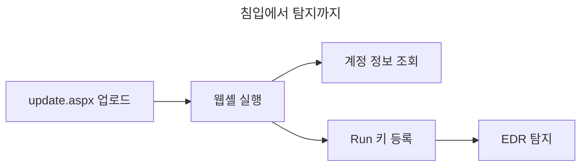

# re:versing.zip

리버스 엔지니어링 기록과 위협·침해대응·기술보안 보고서를 GitHub Pages로 내는 정적 사이트.

본문만 쓰면 글 번호·목차·절 번호·그림/표/코드 번호·각주·개정 이력·참고자료 패널·주제별 색인·시리즈 호수·소식 요약표가 자동으로 붙는다. 「PDF 내려받기」를 누르면 워터마크가 찍힌 A4 보고서로 나온다.

- 저장소: <https://github.com/nechyo/my-book>
- 주소: <https://reversing.zip> (Cloudflare → GitHub Pages)
- `nechyo.github.io/my-book`는 위 도메인으로 넘어갑니다.

---

## 1. 로컬에서 먼저 보기 (파이썬)

Ruby 없이, 파이썬만으로 사이트 전체를 실제 조판 그대로 띄운다. 발행 목록·주제별·소개·각 보고서 링크가 모두 동작한다.

```bash
python -m pip install markdown pyyaml pygments   # 처음 한 번
python tools/preview.py --watch                  # http://localhost:8787
```

`--watch`를 붙이면 글·그림·스타일을 저장할 때마다 다시 빌드하고, 열어 둔 브라우저도 알아서 새로 고친다. VS Code로 이 폴더를 열면 이것이 저절로 켜진다(5절).

`published: false`로 숨긴 글과 초안도 로컬 미리보기에서는 보인다. 빌드할 때 글에 새로 쓴 CVE·KVE 제목을 받아 오고, 글이 쓰는 그림에서 촬영 정보(EXIF·GPS) 같은 메타데이터를 지운다. 종료는 <kbd>Ctrl</kbd>+<kbd>C</kbd>.

---

## 2. 배포

푸시하면 `.github/workflows/pages.yml`이 빌드·배포한다. Pages는 워크플로가 자동으로 활성화한다(`configure-pages` `enablement: true`).

```bash
git add -A
git commit -m "새 글"
git push
```

첫 빌드는 2~3분 걸린다. 진행 상황은 저장소 **Actions** 탭에서 볼 수 있다.

초안 폴더(`_reports/_drafts/`)는 git이 무시하므로 `git add -A`를 해도 올라가지 않는다. 저장소가 공개 상태라서, 올라가면 사이트에 안 떠도 누구나 읽을 수 있다.

---

## 3. 글 쓰기

```powershell
.\tools\new.ps1 "문자열 난독화 추적" -Labels Windows,난독화
.\tools\new.ps1 "탐지 회피라는 표현" -Type obs
.\tools\new.ps1 "9월 라자루스 동향" -Type ti -Series "라자루스 추적" -Actor "Lazarus Group"
.\tools\new.ps1 "개발망 침해 대응" -Type ir -Severity 높음
.\tools\new.ps1 "OO 제품 인증 우회" -Type ts
.\tools\new.ps1 "주간 위협 동향" -Type digest -Series "주간 동향"
```

`-Type`에 맞는 앞머리와 절 뼈대, 부품 틀이 채워진 파일이 생긴다. 종류는 한글(`침해대응`)로 적어도 된다. 필수는 `title`과 `date` 둘뿐이고, 쓰지 않는 항목은 지우면 된다.

### 초안과 발행

새 글은 `_reports/_drafts/`에 초안으로 생긴다. 이 폴더는 git에 올라가지 않고 Jekyll도 읽지 않는다. 로컬 미리보기에서는 목록 맨 위 「초안 · 로컬 전용」에 모이고, 글에는 「초안 · 발행 전」 표시와 `초안` 문서 번호가 붙는다. 번호는 발행할 때 매겨진다.

다 쓰면 발행한다.

```bash
python tools/publish.py _reports/_drafts/<파일>.md           # 점검 → _reports/ 로 옮김, 날짜는 오늘로
python tools/publish.py _reports/_drafts/<파일>.md --keep-date
python tools/publish.py --check _reports/<파일>.md           # 고치지 않고 점검만 (발행한 글도 된다)
python tools/publish.py --list                              # 초안 목록
```

발행 전에 이것을 본다. 걸리면 아무것도 옮기지 않는다.

- TLP가 CLEAR가 아니면 발행하지 않는다.
- 이 컴퓨터의 사용자 이름, git 전역 이름·메일이 본문이나 그림 파일에 있으면 멈춘다. 분석 VM 경로(`C:\Users\<이름>\...`)가 그대로 들어간 경우를 잡으려는 것이다.
- 코드 블록 밖에 `example.*`가 아닌 메일 주소가 있으면 알려 준다.
- 초안 폴더의 그림을 `assets/img/<글 이름>/`으로 옮기고 경로를 `/assets/...`로 고친다. 메타데이터는 지운다.

### 강조 표시

| 쓰는 법 | 보이는 모양 |
|---|---|
| `==중요한 말==` | 형광펜 |
| `++밑줄 칠 말++` | 밑줄 |
| `~~지운 말~~` | 삭제선 |
| `<kbd>F5</kbd>` | 키 |

코드(`` ` ``로 감싼 곳, 코드 블록)는 건드리지 않는다. `C++`, `a == b`처럼 글자에 붙었거나 양쪽을 띄운 기호도 그대로 둔다. 인쇄·PDF에서는 형광펜이 회색 띠로 나온다. 정정 상자 안에서 `~~틀린 말~~ 고친 말`로 쓰면 무엇을 고쳤는지 보인다.

### 그림

VS Code에서 스크린숏을 글에 붙여 넣으면(<kbd>Ctrl</kbd>+<kbd>V</kbd>) 파일이 저장되고 `` 줄이 들어간다. 파일을 끌어다 놓아도 된다. 초안이면 `_reports/_drafts/img/<글 이름>/`, 발행한 글이면 `assets/img/<글 이름>/`에 저장된다.

- 그림만 있는 줄은 「그림 N」 번호가 붙고, `설명`이 캡션이 된다. 설명을 비우면 캡션과 번호 없이 그림만 나온다. VS Code가 넣는 `Alt text`를 그대로 두면 캡션 없이 나오고, 발행 점검에서 알려 준다.
- 그림을 누르면 크게 보인다. <kbd>Esc</kbd>로 닫는다.
- 미리보기와 발행 때 촬영 정보(EXIF·GPS), 편집 프로그램 기록, PNG 텍스트 같은 메타데이터를 지운다. 사진 방향 정보만 남긴다. 그림 속 화면(창 제목·경로·계정 이름)은 눈으로 한 번 더 본다.

### 덧붙이기와 출처

발행 후 알게 된 내용은 원문을 고치지 말고 덧붙인다.

```html
<div class="addendum" data-date="2026-09-21" markdown="1">추가로 확인한 내용.</div>
<div class="correction" data-date="2026-09-20" markdown="1">오류와 정정 내용.</div>
```

넣으면 문서 하단 「개정 이력」, 표제부 「최종 개정」, 목록 `개정 N회`가 자동으로 따라온다.

참고자료는 앞머리 `references:`에 적고 본문에서 `<cite data-ref="N"></cite>`로 끼운다. 찾아서 넣는 건 5절 「자료 찾기」가 해 준다. 도표·그래프는 코드 펜스에 `mermaid` 또는 `chart`를 지정한다.

---

## 4. 보고서 종류와 부품

리버싱 분석 말고도 위협 행위자 보고서, 침해대응 보고서, 기술보안 보고서, 여러 소식을 묶은 보고서를 같은 방식으로 낸다. 본문만 쓰면 나머지는 자동이라는 원칙은 같다.

### 종류

| `-Type` | 앞머리 `kind` | 뼈대 |
|---|---|---|
| `re` 리버싱 (기본) | 심층분석 | 출발점 · 확인한 것 · 미해결 |
| `obs` 관찰 | 관찰 | 출발점 · 짚어 본 것 · 정리 · 미해결 |
| `ti` 위협 | 위협 인텔리전스 | 소식 묶음 · 종합 평가 · 공격 흐름 · 전술·기법 · 침해 지표 · 귀속 근거 · 탐지·대응 권고 |
| `ir` 침해대응 | 침해대응 | 개요 · 타임라인 · 침입 경로 · 영향 범위 · 침해 지표 · 전술·기법 · 대응 조치 · 재발 방지 권고 |
| `ts` 기술보안 | 기술보안 | 배경 · 기술 분석 · 영향 · 탐지 방법 · 대응 권고 |
| `digest` 동향 | 동향 | 소식 묶음 · 종합 평가 |

발행 목록에 종류가 둘 이상 섞이면 목록 위에 종류별 필터가 생긴다. 필터를 누르면 주소 끝에 `#k=침해대응`처럼 붙어서 그 상태로 링크를 공유할 수 있다.

### 앞머리 항목

| 항목 | 보이는 곳 |
|---|---|
| `series: 라자루스 추적` | 문서줄과 표제부에 「제N호」, 글 하단에 시리즈 목차. 호수는 같은 시리즈 안에서 날짜순으로 매겨진다 |
| `tlp: CLEAR` | 제목 위 TLP 배지(FIRST TLP 2.0 색), 인쇄 워터마크, PDF 출처 줄 |
| `severity: 높음` | 심각도 배지. `긴급` · `높음` · `중간` · `낮음` |
| `period` | 표제부 「대상 기간」 |
| `actor`, `aliases` | 표제부 「위협 행위자」. `actor: G0032`처럼 그룹 번호를 쓰면 그룹 이름과 별칭, MITRE 출처가 자동으로 붙는다 |
| `meta:` | 표제부에 `키: 값`마다 한 줄. 최초 탐지, 영향 범위, 신뢰도 같은 것 |
| `items:` | 「이번 호 소식」 요약표와 소식마다 번호가 붙은 절 |

### 소식 묶기

어느 종류든 `items:`에 소식을 나열하면 소식 묶음이 된다. 본문(종합 평가 등)은 소식 뒤에 이어진다. `refs`는 `references:`의 번호이고, `note`는 소식 아래 「평가」 상자로 나온다. 소식 묶음에서는 목차 대신 요약표가 그 자리를 맡는다.

```yaml
items:
  - title: 채용 과제 파일로 시작하는 초기 접근
    date: 2026-09-22
    tag: 초기 접근
    summary: |
      무엇이 있었고 무엇을 확인했는지.
    refs: [1, 2]
    note: 기존 채용 미끼 수법과 같은 계열로 본다.
```

### 부품

코드 펜스 언어 이름으로 부른다. `//`로 시작하는 줄은 무시한다.

**`ioc` 침해 지표.** 한 줄에 하나, `|` 뒤는 비고, `[그룹명]` 줄로 묶는다. 유형은 값을 보고 정한다(MD5·SHA-1·SHA-256·IP·CIDR·도메인·URL·이메일·경로·레지스트리·파일명·CVE). 애매하면 줄 앞에 `sha256` · `domain` · `file` · `mutex` · `ua` 같은 낱말을 붙인다. 화면에는 항상 디팽(`hxxp`, `[.]`)해서 보이고, 이미 디팽된 값을 넣어도 알아서 읽는다. 「전체 복사」는 디팽된 목록을 복사한다.

````markdown
```ioc
[네트워크]
hxxps://update.example.net/beacon | 비컨
198.51.100.23:443 | 접속지
[호스트]
C:\ProgramData\example\svchelper.dll | 드롭된 DLL
mutex Global\a1b2c3d4 | 중복 실행 방지
```
````

**`timeline` 타임라인.** `시각 | 내용 | 꼬리표`. 꼬리표는 없어도 된다. 핵심 사건은 줄 앞에 `*`, 단계 구분은 `[단계명]` 줄.

````markdown
```timeline
[탐지]
* 2026-09-19 02:14 | EDR이 `w3wp.exe`의 `cmd.exe` 생성 탐지 | EDR
2026-09-19 10:00 | 해당 서버 격리
```
````

**`attack` ATT&CK 매핑.** `전술 | 기법 ID | 기법 | 근거`. 전술은 빼도 된다. 기법 칸을 비우면 MITRE 정식 이름으로 채운다. 기법 ID는 MITRE ATT&CK 페이지로 연결되고, 「ID 복사」로 ID만 모아 복사한다.

````markdown
```attack
초기 침투 | T1566.001 | 스피어피싱 첨부 | 채용 과제 파일
지속성 | T1547.001 | 레지스트리 Run 키 | SvcHelper 값 등록
```
````

**`mermaid` 다이어그램.** 흐름도·순서도를 글자로 그린다. 색은 사이트 테마를 따라가서 라이트·다크를 바꾸면 다시 그려진다. 코드 같은 글자는 모노 글꼴로, 한글은 본문 글꼴로 나온다.

- 맨 위 `title:`이 「그림 N」 캡션이 된다. 없으면 번호 없이 그림만 들어간다.
- 강조할 단계 뒤에 `:::key`를 붙이면 빨간 테두리와 글자로 표시된다.
- 인쇄·PDF에서는 흑백으로 나오고, 강조한 단계만 빨간 테두리가 남는다.

````markdown

````

### 출처 달기

출처는 앞머리 `references:`에 적고 본문에서 번호로 부른다. 인용 자리에는 `[2] 출처명 날짜`처럼 번호가 같이 찍혀서, 출처명이 같아도 구별된다. PDF에서는 `[2]`만 남고, 끝의 참고자료 목록에 URL까지 나온다.

| 어디서 | 쓰는 법 |
|---|---|
| 본문 | `<cite data-ref="2"></cite>` |
| 소식 묶음 | 소식마다 `refs: [1, 2]` |
| 침해 지표·타임라인·ATT&CK 표 | 비고·내용·근거 칸 끝에 `[2]` 또는 `[1, 3]`. 코드 조각 안의 `argv[1]` 같은 건 건드리지 않는다 |

**ATT&CK 번호는 출처가 저절로 달린다.** 본문·요지·타임라인·ATT&CK 표·표제부 어디든 ATT&CK 번호를 쓰면 MITRE 페이지로 링크가 걸리고, 참고자료에 「이름 (번호)」 항목이 자동으로 붙는다. 번호에 마우스를 올리면 그 출처가 뜬다.

- 기법 `T1566`, 하위 기법 `T1566.001`, 전술 `TA0001`, 그룹 `G0032`, 소프트웨어 `S0584`, 캠페인 `C0022`, 완화 `M1017`을 알아본다.
- 실제 ATT&CK에 있는 번호만 링크하므로 부품 번호 같은 비슷한 글자는 건드리지 않는다. 코드 블록 안도 건드리지 않는다.
- 같은 번호는 몇 번을 써도 출처가 한 번만 들어간다. MITRE 출처를 `references:`에 직접 적어 둔 번호는 새로 만들지 않고 그 항목에 잇는다.
- 자동 출처 번호는 직접 적은 출처 뒤에 이어진다. 그래서 직접 적은 출처의 번호는 흔들리지 않는다.

번호와 이름은 `_data/attack.json` 사전에서 온다. ATT&CK 새 버전이 나오면 한 번 갱신한다. 자료 찾기용 인용 문헌 목록과 VS Code 자동완성도 같이 갱신된다.

```bash
python tools/attack.py
```

**CVE·KVE 번호도 출처가 저절로 달린다.** 본문·침해 지표·표 어디든 번호를 쓰면 된다.

- `CVE-2024-3400`은 NVD 페이지로 링크되고, 참고자료에 「제목 (번호)」와 `NVD · CVSS 10.0 CRITICAL · 공개 2024-04-12`가 붙는다. 제목과 점수는 CVE.org에서 받는다.
- `KVE-2023-6187` 같은 KVE(KISA가 매기는 국내 취약점 번호)는 KISA 사이버 보안 취약점 정보 포털에서 찾는다. 공지가 있으면 그 공지로, 없으면 포털의 취약점 목록으로 링크한다.
- 제조사 공지처럼 번호를 제목에 넣어 `references:`에 직접 적은 출처가 있으면 자동 항목을 만들지 않고 그 출처로 잇는다.
- 제목은 미리보기를 켤 때 받아 `_data/vulns.json`에 쌓인다. 인터넷이 안 되면 번호와 링크만 붙는다. 초안에만 쓴 번호는 `_reports/_drafts/.vulns.json`에 따로 두어, 무엇을 쓰는 중인지 저장소에 새지 않게 한다.

### TLP와 공개 범위

공개 사이트에는 TLP:CLEAR만 올린다. GREEN·AMBER·RED 문서는 초안 폴더에 둔 채 쓰고, 로컬 미리보기에서 「PDF 내려받기」로 뽑는다. 초안 폴더는 저장소에도 올라가지 않는다. `new.ps1 -Tlp AMBER`처럼 CLEAR가 아니면 `published: false`까지 들어가고, `tools/publish.py`는 발행을 거부하고, `tools/preview.py`는 공개 상태인 비-CLEAR 문서를 빌드할 때 경고를 띄운다. 미리보기에서 이런 문서는 번호 대신 `비공개`로 나오고, 번호가 필요하면 앞머리에 `docket: 2026-IR-01`처럼 직접 적는다.

---

## 5. VS Code에서 쓰기

이 폴더를 VS Code로 열면 `.vscode/`의 설정이 그대로 쓰인다. 파이썬 도구는 VS Code가 대신 돌린다.

**저절로 되는 것**

- 폴더를 열면 미리보기가 켜진다(작업 「미리보기 (자동 시작)」). 처음 한 번 VS Code가 자동 작업을 허용할지 묻는다. 허용하면 된다. 놓쳤으면 명령 팔레트에서 `Tasks: Manage Automatic Tasks`로 허용한다.
- 저장하면 다시 빌드되고 열어 둔 브라우저가 새로 고쳐진다. 새로 쓴 CVE·KVE 제목도 이때 받아 오고, 그림 메타데이터도 이때 지운다.
- <kbd>Ctrl</kbd>+<kbd>Shift</kbd>+<kbd>B</kbd>는 미리보기를 켜고 목록과 최근 글 주소를 보여 준다. 주소를 <kbd>Ctrl</kbd>+클릭하면 VS Code 안 옆 칸에 열린다. VS Code 밖에서 실행하면 기본 브라우저가 열린다.
- 그림을 붙여 넣으면 알맞은 폴더에 저장된다.
- `powershell`, `lazarus`처럼 이름 일부를 치면 ATT&CK 번호 후보가 뜨고 <kbd>Tab</kbd>으로 넣는다. `ioc`, `attack`, `timeline`, `cite`, `추가`, `정정`, `그림`, `형광펜`, `밑줄`, `삭제선`, `ref`, `item`도 <kbd>Tab</kbd>으로 틀이 들어간다. <kbd>Enter</kbd>는 후보를 고르지 않고 줄만 바꾼다.
- 글자를 고른 뒤 명령 팔레트 → `Snippets: Surround With`에서 형광펜·밑줄·삭제선을 고르면 고른 글자에 씌운다.

**작업으로 부르는 것** (명령 팔레트 → `Tasks: Run Task`)

| 작업 | 하는 일 |
|---|---|
| 자료 찾기 | 고른 글자로(없으면 물어본다) 자료를 찾는다. 번호를 고르면 지금 연 글의 `references:`에 넣는다 |
| 번호 찾기 | 고른 이름·번호로 ATT&CK 번호나 CVE·KVE 제목을 찾는다 |
| 새 글 (초안) | 제목과 종류를 물어 초안을 만들고 편집기에 연다 |
| 발행 전 점검 | 지금 연 글을 고치지 않고 점검한다 |
| 발행 | 지금 연 초안을 점검하고 `_reports/`로 옮긴 뒤 편집기에 연다 |
| 초안 목록 | 초안 폴더의 글을 보여 준다 |

자주 쓰는 작업은 키에 묶으면 편하다. VS Code 키 설정은 폴더별로 둘 수 없어서 사용자 `keybindings.json`에 넣는다.

```json
{ "key": "ctrl+alt+f", "command": "workbench.action.tasks.runTask", "args": "자료 찾기" },
{ "key": "ctrl+alt+l", "command": "workbench.action.tasks.runTask", "args": "번호 찾기" }
```

### VS Code 안에서 미리보기

미리보기는 이 컴퓨터에서 도는 작은 웹 서버(`http://localhost:8787`)다. 그래서 주소를 열면 원래는 기본 브라우저로 간다. 이 폴더 설정은 VS Code 내장 브라우저가 localhost 주소를 받아 편집기 옆 칸에 열게 한다.

1. <kbd>Ctrl</kbd>+<kbd>Shift</kbd>+<kbd>B</kbd>를 누른다.
2. 아래 터미널에 목록과 최근 글 주소가 나온다. 최근 글은 가장 최근에 저장한 글이다.
3. 주소를 <kbd>Ctrl</kbd>+클릭하면 옆 칸에 열린다. 저장할 때마다 그 칸도 새로 고쳐진다.

안 될 때는 이것부터 본다.

| 증상 | 까닭과 할 일 |
|---|---|
| 주소를 눌러도 바깥 브라우저가 열린다 | 이 설정은 VS Code가 시작할 때 읽는다. 명령 팔레트에서 `Reload Window`를 한 번 실행한다 |
| "연결할 수 없음" 페이지가 뜬다 | 미리보기가 꺼져 있다. <kbd>Ctrl</kbd>+<kbd>Shift</kbd>+<kbd>B</kbd>로 켠다 |
| 폴더를 열어도 미리보기가 저절로 안 켜진다 | 자동 작업을 아직 허용하지 않았거나, VS Code 창이 이미 열려 있어 「폴더를 열 때」가 성립하지 않은 것이다. 명령 팔레트에서 `automatic tasks`를 찾아 이 폴더에만 허용하거나 <kbd>Ctrl</kbd>+<kbd>Shift</kbd>+<kbd>B</kbd>를 누른다 |
| 내장 브라우저가 없다는 식으로 나온다 | 옛 VS Code다. 명령 팔레트의 `Simple Browser: Show`에 주소를 넣으면 같은 화면이 뜬다 |
| VS Code가 갑자기 닫힌다 | 업데이트를 설치하는 중일 수 있다. 몇 분 뒤 다시 열면 된다 |

자동 작업은 악성 저장소가 악용하기도 하는 기능이라 VS Code가 폴더마다 허락을 받는다. 전체 설정으로 켜지 말고 이 폴더에만 허용한다. 미리보기가 VS Code 밖에서 먼저 켜져 있어도 된다. 그때 <kbd>Ctrl</kbd>+<kbd>Shift</kbd>+<kbd>B</kbd>는 새로 띄우지 않고 다시 빌드한 뒤 주소만 보여 준다.

### 자료 찾기

```bash
python tools/find.py lazarus npm
python tools/find.py ivanti --into _reports/_drafts/<파일>.md
python tools/find.py dream job --only attack
```

| 찾는 곳 | 내용 |
|---|---|
| MITRE ATT&CK 인용 문헌 | 그룹·소프트웨어·캠페인 이름이 맞으면 MITRE가 그 항목에 인용한 보고서를 최신순으로 |
| KISA 보안공지 | KISA 사이버 보안 취약점 정보 포털의 보안 업데이트 권고 |
| 웹 | 보안 업체·CERT·제조사 문서를 위로, 뉴스는 뒤로 보내고 「뉴스」 표시. SNS는 뺀다 |
| CVE | 같은 포털의 CVE 검색. 번호만 본문에 쓰면 출처가 붙으므로 번호·CVSS·KEV 여부만 보여 준다 |

웹 검색은 `SEARXNG_URL`(기본 `http://127.0.0.1:8888`)에 SearXNG가 켜져 있으면 그것을, 아니면 DuckDuckGo를 쓴다. 번호를 고르면 제목·출처·URL·날짜가 앞머리에 들어가고, 본문에 끼울 `<cite data-ref="N"></cite>`를 알려 준다. 날짜를 모르는 웹 자료는 `accessed:`(열람일)로 들어간다. 이미 있는 URL은 다시 넣지 않는다.

### 번호 찾기

```bash
python tools/lookup.py powershell        # T1059.001 ...
python tools/lookup.py lazarus           # G0032, 별칭 포함
python tools/lookup.py CVE-2024-3400     # 제목·CVSS·공개일
```

---

## 6. 도메인 (`reversing.zip`)

`reversing.zip`은 Cloudflare에서 관리되며, GitHub Pages 앞단에 Cloudflare가 프록시로 붙어 있다. 저장소에는 다음이 반영되어 있다.

- `CNAME` 파일에 `reversing.zip`
- `_config.yml` — `url: "https://reversing.zip"`, `baseurl: ""` (최상위 도메인이므로 경로 접두사 없음)
- 워크플로는 `baseurl` 접두사 없이 빌드한다 (프로젝트 페이지의 `/my-book/` 접두사를 쓰지 않기 위함)

Cloudflare 쪽 DNS는 `nechyo.github.io`로 향하게 되어 있다. Cloudflare 프록시(주황 구름)를 쓰는 경우 SSL/TLS 모드는 **Full**로 둔다. GitHub의 도메인 검증까지 하려면 프록시를 잠시 끄고(회색 구름) apex A 레코드를 `185.199.108~111.153`으로 두거나, **Settings → Pages**의 검증용 `TXT` 레코드를 추가한다.

> 로컬 미리보기(`tools/preview.py`)는 항상 루트 경로를 쓰므로 도메인 설정과 무관하게 동작한다.

---

## 7. 예시 글

`_reports/`에 형식 예시가 네 편 있다.

- `infostealer-string-layer`, `evades-detection-phrase` — 리버싱·관찰 글 형식. 지금 공개 상태(`published: true`)다.
- `example-lazarus`, `example-incident` — 소식을 묶은 위협 보고서(시리즈 포함)와 TLP:AMBER 침해대응 보고서 형식. `published: false`라 로컬 미리보기에서만 보인다. 침해대응 예시에 강조 표시·그림·정정·CVE·KVE 쓰는 법이 들어 있다.

예시의 해시·IP·도메인은 전부 자리표시자다. IP는 문서용 예약 대역(`192.0.2.0/24` 등), 도메인은 `example.*`를 쓴다. 진짜 글을 올릴 때 지우거나 참고해서 바꾼다.

---

## 8. 구조

```
_config.yml              사이트 설정 (title / author / repo / url / 피드)
index.html               발행 목록
labels.html              주제별 색인
about.md                 이 기록에 대하여
_reports/*.md            글 (여기만 늘어난다)
_reports/_drafts/        초안과 비공개 문서 (git·Jekyll 모두 무시)
_layouts/                base · report · page
_includes/               head · masthead · colophon · docket-no
_data/attack.json        ATT&CK 번호 사전 (tools/attack.py 가 만든다)
_data/vulns.json         발행한 글에 쓴 CVE·KVE 제목 (미리보기·tools/lookup.py 가 채운다)
assets/data/             위 두 사전을 브라우저용으로 내보내는 틀
assets/img/<글 이름>/     글에 쓰는 그림
assets/fonts/            IBM Plex Mono (자체 호스팅)
assets/css/report.css    조판 (화면 + A4 인쇄 + 워터마크 + 보고서 부품)
assets/css/cursors.css   커서 모음 (tools/cursors.py 가 만든다)
assets/js/report.js      목차·각주·개정 이력·참고자료 패널·다이어그램·그래프·침해 지표·타임라인·ATT&CK·CVE·KVE·강조 표시·그림·종류 필터
tools/new.ps1            새 글을 초안으로 생성 (종류별 뼈대)
tools/publish.py         발행 전 점검·초안 발행·그림 메타데이터 지우기
tools/find.py            자료 찾기
tools/lookup.py          번호 찾기 (ATT&CK·CVE·KVE)
tools/attack.py          ATT&CK 번호 사전·인용 문헌 목록·자동완성 갱신
tools/attack-refs.json.gz  ATT&CK 인용 문헌 목록
tools/preview.py         로컬 미리보기 서버 (--watch 로 저장할 때마다 다시 빌드)
tools/cursors.py         커서 모음 그리기
.vscode/                 VS Code 설정·작업·자동완성
.github/workflows/       빌드·배포
```

조판을 바꾸려면 `assets/css/report.css` 맨 위 토큰(바탕·잉크·강조색·판면 폭·글꼴)만 고치면 된다.

커서는 `tools/cursors.py`가 그려 `assets/css/cursors.css`로 쓴다. 기본 조준선, 링크 위 조준 괄호, 글자 위 I빔, 그림 확대·축소, 도움말, 누를 수 없음, 불러오는 중까지 여덟 가지를 라이트·다크 두 벌로 만든다. 모양이나 색을 바꾸려면 그 파일을 고친 뒤 `python tools/cursors.py`를 다시 돌린다. 페이지가 커서를 따로 그리지 않고 브라우저가 이 그림을 커서로 쓰므로, 포인터가 둘로 겹쳐 보이지 않는다.

- 글자나 링크를 끌어서 옮기는 동작은 꺼 두었다. 끄지 않으면 끄는 동안 시스템 커서로 바뀐다. 글자를 드래그해 고르는 것은 그대로 된다.
- 페이지를 옮겨 갈 때 잠깐 뜨는 로딩 커서는 브라우저가 직접 그리는 것이라 페이지에서 바꿀 수 없다.
- 페이지 스크롤바는 숨겼다. 대신 글을 읽을 때 화면 맨 위 빨간 선이 지금 위치만큼 차오른다. 코드 블록처럼 옆으로 넘기는 칸에는 얇은 스크롤바를 남겼다.
- 조금 내려가면 오른쪽 아래에 맨 위로 가는 버튼이 생긴다. PDF 저장은 표제부의 「PDF 내려받기」 하나로 하고, 저장 방법은 그 버튼에 마우스를 올리면 나온다.

`tools/preview.py`는 Jekyll 레이아웃을 읽지 않고 같은 화면을 파이썬으로 따로 그린다. 머리글·내비·목록·표제부 구조를 바꿀 때는 `_layouts`·`_includes`와 `tools/preview.py`를 같이 고쳐야 두 화면이 어긋나지 않는다.
