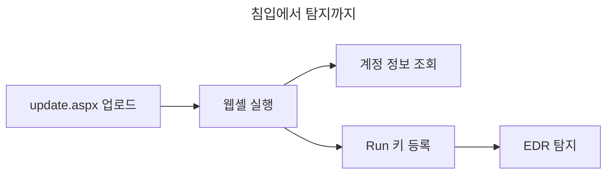

<div class="remark" data-date="예시" markdown="1">
형식 예시입니다. 사건·시각·지표는 모두 자리표시자이며 실제 사고가 아닙니다. TLP:AMBER 문서라 `published: false`로 두었고, 로컬 미리보기와 PDF로만 봅니다.
</div>

## 개요

사내 웹 서버의 파일 업로드 기능이 확장자만 보고 내용을 검사하지 않았습니다. 공격자는 이 틈으로 웹셸을 올렸고 <cite data-ref="2"></cite>, 이틀 뒤 EDR이 IIS 작업자 프로세스에서 `cmd.exe`가 뜨는 것을 잡았습니다.

## 타임라인

```timeline
[침투]
* 2026-09-17 23:05 | `update.aspx` 업로드 (웹 로그로 역추적) | 웹 로그
2026-09-18 01:40 | 웹셸로 계정 정보 조회
[탐지]
* 2026-09-19 02:14 | EDR이 `w3wp.exe`의 `cmd.exe` 생성 탐지 | EDR
2026-09-19 02:40 | 당직자 확인, 사고로 분류
[대응]
2026-09-19 10:00 | 해당 서버 네트워크 격리
2026-09-19 15:20 | 웹셸 제거, 서비스 계정 비밀번호 변경
```

## 침입 경로

업로드 처리 코드가 ==확장자 목록만== 확인했습니다. `.aspx`를 막지 않았고, 저장 경로도 ++실행 가능한 웹 루트 아래++였습니다.




## 영향 범위

| 대상 | 영향 | 조치 |
|---|---|---|
| 웹 서버 1대 | 웹셸 설치, 레지스트리 지속성 | 격리 후 재구축 예정 |
| 서비스 계정 2개 | 정보 조회 흔적 | 비밀번호 변경 |

<div class="correction" data-date="2026-09-28" markdown="1">
조회 흔적이 나온 계정 수를 바로잡습니다. ~~서비스 계정 2개~~ 서비스 계정 3개입니다. 세 번째 계정은 인증 로그를 다시 보다 찾았습니다.
</div>

## 침해 지표

```ioc
[네트워크]
hxxps://update.example.net/api/v2/beacon | 비컨 주소. 이미 디팽된 값도 그대로 받는다
cdn-static.example.org | 2단계 배포
198.51.100.23:443 | 비컨 접속지
[호스트]
C:\ProgramData\Microsoft\Crypto\svchelper.dll | 드롭된 DLL
HKCU\Software\Microsoft\Windows\CurrentVersion\Run\SvcHelper | 지속성
mutex Global\a1b2c3d4 | 중복 실행 방지
[파일]
sha256 1111111111111111111111111111111111111111111111111111111111111111 | svchelper.dll
md5 22222222222222222222222222222222 | update.aspx
update.aspx | 웹셸 파일명
```

## 전술·기법

```attack
초기 침투 | T1190 | 공개 애플리케이션 취약점 악용 | 업로드 검증 누락
지속성 | T1505.003 | 웹셸 | `update.aspx` [2]
지속성 | T1547.001 | 레지스트리 Run 키 | `SvcHelper` 값 등록
명령 및 제어 | T1071.001 | 웹 프로토콜 | HTTPS 비컨
```

## 대응 조치

- 서버를 네트워크에서 떼고 메모리와 디스크 이미지를 떴습니다.
- 웹셸과 드롭된 DLL을 지우고, Run 키 값을 삭제했습니다.
- 서비스 계정 비밀번호를 바꾸고 세션을 끊었습니다.

## 재발 방지 권고

- 업로드는 확장자가 아니라 내용으로 검사하고, 실행 불가능한 경로에 저장합니다.
- 웹 서버 작업자 프로세스가 셸을 띄우면 바로 경보가 가게 합니다.
- 경계 장비는 CVE-2024-3400처럼 공개 서비스에서 바로 악용되는 취약점부터 패치 여부를 봅니다.
- 국내 제품은 KVE 번호로 공지되는 경우가 많아 제조사 공지와 함께 확인합니다(형식 예: KVE-2023-6187).

## 미해결

- 같은 대역의 다른 서버로 옮겨 간 흔적이 있는지 아직 확인하지 못했습니다.
