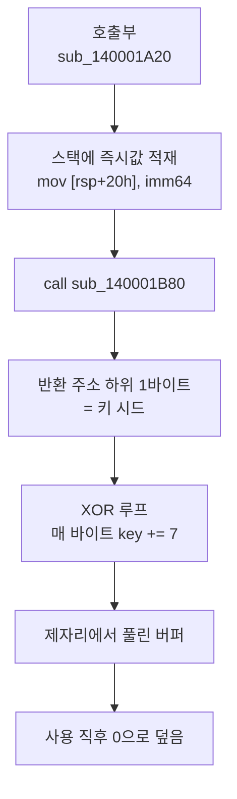

<div class="remark" data-date="예시" markdown="1">
이 글은 사이트 조판을 보여주기 위한 예시입니다. 해시·오프셋·도메인은 형식을 위한 자리표시자이며 실제 값이 아닙니다.
</div>

## 출발점

정적 분석 도구로 열었더니 문자열이 하나도 안 잡히는 표본이 있었습니다. 보통 이러면 패킹을 의심하는데, 섹션 엔트로피는 낮고 임포트 테이블도 멀쩡합니다. 패킹은 아니라는 뜻입니다.

그러면 문자열만 따로 손봤다는 이야기가 됩니다. 방식을 알아야 복호화기를 만들 수 있으니, 직접 뜯어봤습니다.

## 표본과 환경

| 항목 | 값 |
|---|---|
| 파일 | `sample.exe`, PE32+, 412 KB |
| SHA-256 | `7c1e…9ab4` |
| 컴파일 타임스탬프 | 2026-08-30 11:42:07 UTC |
| 섹션 | `.text` `.rdata` `.data` `.pdata` `.rsrc` <cite data-ref="2"></cite> |
| 엔트로피 | `.text` 6.41 / `.rdata` 5.02 |
| 패킹 | 없음 (섹션 엔트로피·임포트 테이블 정상) |

엔트로피가 낮고 임포트도 정상인데 `strings`가 빈손인 조합, 이게 첫 단서였습니다.

## 문자열의 위치

`.rdata`에는 암호화된 블롭이 없습니다. 대신 `.text` 안에 이런 패턴이 반복됩니다.

도입부만 옮기면 다음과 같습니다.
{: .listing}

```nasm
sub_140001A20:
  sub     rsp, 48h
  mov     rax, 0A3B1C7D9E2F40518h
  mov     [rsp+20h], rax
  mov     rax, 0F10D2C3B4A596877h
  mov     [rsp+28h], rax
  mov     dword ptr [rsp+30h], 0C4D5E6F7h
  lea     rcx, [rsp+20h]
  mov     edx, 14h
  call    sub_140001B80
```

문자열을 상수로 두지 않고, 필요한 자리에서 즉시값으로 스택에 쌓은 뒤 복호화 함수로 넘깁니다. `rcx`에 버퍼, `edx`에 길이를 실어 보내는 걸로 봐서 평범한 `__fastcall`입니다. <cite data-ref="1"></cite> 반환값은 같은 버퍼고, 제자리에서 풉니다.

스택 문자열이야 오래된 수법인데, 여기엔 한 겹이 더 있습니다.

## 복호화 루틴

### 루프 본체

```nasm
sub_140001B80:
  push    rbx
  mov     rbx, rcx
  mov     r8d, edx
  mov     rax, [rsp+8]          ; 반환 주소
  movzx   r9d, al               ; 키 시드 = 반환 주소 하위 1바이트
  xor     r10d, r10d
loc_140001B95:
  mov     al, [rbx+r10]
  xor     al, r9b
  add     r9b, 7
  mov     [rbx+r10], al
  inc     r10d
  cmp     r10d, r8d
  jb      loc_140001B95
  mov     rax, rbx
  pop     rbx
  ret
```

바이트마다 XOR을 걸고 키를 7씩 올립니다. 루프 자체는 흔합니다. 문제는 네 번째 줄입니다.

```nasm
  mov     rax, [rsp+8]
  movzx   r9d, al
```

키 시드를 반환 주소의 하위 바이트에서 가져옵니다. 복호화 함수는 하나인데, 어디서 불렀느냐에 따라 키가 매번 달라진다는 뜻입니다. `call` 다음 주소의 하위 8비트가 그 문자열의 키인 셈입니다.

단순 정적 추출이 통하지 않는 이유가 여기 있습니다. 복호화 루틴만 찾아 키 하나로 전부 돌리면, 첫 문자열만 풀리고 나머지는 깨집니다.[^1]

[^1]: 처음엔 이걸 놓쳤습니다. 첫 호출부 키로 전부 돌려 보고 "키가 여러 개"라고 적었다가, 호출부마다 키가 이미지 베이스 기준 오프셋과 맞아떨어지는 걸 보고 되짚었습니다.

<div class="correction" data-date="2026-09-20" markdown="1">
초판에는 키 시드를 반환 주소의 **상위** 바이트라고 적어 뒀습니다. `movzx r9d, al`이니 하위 바이트가 맞습니다. 본문을 바로잡았습니다. 짚어 주신 분께 감사합니다.
</div>

### 호출 경로

전체 흐름은 이렇게 됩니다.



마지막 칸도 성가십니다. 풀린 문자열은 쓰자마자 `memset`으로 지워집니다. 메모리를 한 번 덤프해서 긁는 방법이 잘 안 통하는 이유고, 결국 시점을 맞춰야 합니다.

## 자동 복호화

호출부를 전부 찾아 각 반환 주소로 키를 계산하면 됩니다. IDAPython으로 `call sub_140001B80` 참조를 돌면서 호출 직전 스택 적재를 거꾸로 읽었습니다.

```python
KEY_STEP = 7

def decrypt(buf: bytes, ret_addr: int) -> bytes:
    key = ret_addr & 0xFF
    out = bytearray(len(buf))
    for i, b in enumerate(buf):
        out[i] = b ^ key
        key = (key + KEY_STEP) & 0xFF
    return bytes(out)
```

이 방식으로 호출부 147곳에서 문자열이 전부 복원됐습니다. 몇 초 걸렸습니다. 손으로 따라갈 땐 반나절이 갔으니, 결국 시간을 잡아먹은 건 방식을 알아채는 것 하나였던 셈입니다.

## 복원 결과

성격별로 세어 보면 이렇습니다.

```chart
type: hbar
title: 복원된 문자열 147건 분류
series: 건수
브라우저 자격증명 경로: 41
암호화폐 지갑 경로: 33
메신저 세션 파일: 22
레지스트리 키: 19
C2 관련 문자열: 12
기타 API 이름: 20
```

브라우저와 지갑 경로가 절반을 넘습니다. 여기까진 흔한 인포스틸러입니다. 눈에 걸린 건 메신저 세션 파일 22건인데, 국내에서 많이 쓰는 클라이언트의 경로가 섞여 있었습니다. 대상이 국내로 좁혀졌다고 볼 만한 대목입니다.

C2 문자열 12건 중 도메인 꼴은 3건이고, 나머지는 경로와 User-Agent입니다.

## 탐지 관점

문자열이 복호화 순간에만 존재하니, 정적 시그니처는 문자열보다 루틴 자체를 잡는 편이 낫습니다. 아래 키 유도 부분은 계열 안에서 그럭저럭 안정적이었습니다.

```text
48 8B 44 24 08     mov  rax, [rsp+8]
0F B6 C8           movzx ecx, al
...
80 C1 07           add  cl, 7
```

다만 `add cl, 7`의 `7`은 빌드마다 바뀔 수 있습니다. 아래 변종에서는 실제로 값이 달랐으니, 와일드카드로 두는 편이 안전합니다.

<div class="addendum" data-date="2026-09-21" markdown="1">
같은 계열로 보이는 표본(SHA-256 `b204…31cc`)이 하나 더 나왔습니다. 뼈대는 같은데 두 군데가 다릅니다.

- 키 증가값이 `7`이 아니라 `0x1F`
- 반환 주소 하위 **2**바이트를 써서 `xor ax, r9w`로 워드 단위 처리

복호화기는 증가값과 폭을 인자로 빼 두는 게 낫겠습니다. 변종 비교는 따로 다룹니다.
</div>

## 미해결

아직 못 본 것들입니다.

- 복원한 도메인 3건 중 2건은 이미 만료였고, 등록 이력은 못 받았습니다.
- 최초 유입 경로는 확인 못 했습니다. 이 표본은 2차로 받은 것입니다.
- `sub_140001B80` 말고 두 번째 복호화 루틴이 `.text` 뒤쪽에 있는데, 참조가 없어 불리지 않습니다. 죽은 코드인지 조건부 경로인지는 판단을 보류합니다.

세 번째는 다음 글에서 봅니다.
